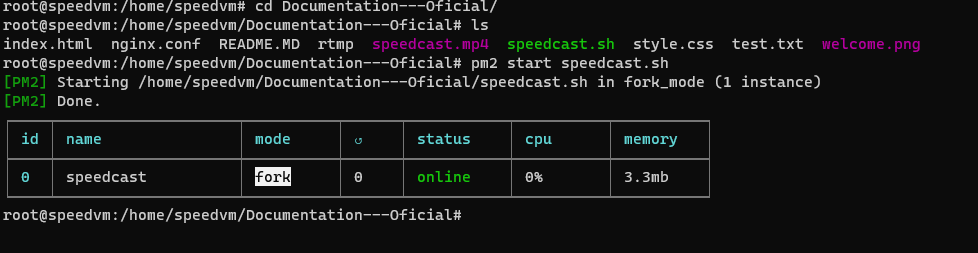

# Video Streaming server - Nginx RTMP/HLS

## Objetivo
Criar um servidor de mídia com NGINX e módulo RTMP. Nesse procedimento iremos receber stream via RTMP e converter para HLS com certificado SSL.

Os arquivos desse procedimento já foram editados para facilitar a configuração do servidor, sendo assim possivel testar o servidor após a finalização do procedimento.

## Pré requesitos

* Ubuntu 20.04

## Depêndencias

* $ sudo apt update
* $ sudo apt install nginx -y && apt install ffmpeg -y
* $ sudo apt install libnginx-mod-rtmp

## NodeJs
Instalação via repositório oficial do NodeJs, necessário para instalar o PM2 (Gerenciador de processos) que será necessário para gerenciar o script ffmpeg.

* cd ~
* curl -sL https://deb.nodesource.com/setup_18.x -o nodesource_setup.sh
* sudo bash nodesource_setup.sh
* sudo apt install nodejs -y

Verifique a versão

* node -v 
* npm -v

Para que todos pacotes node funcione adequadamente, será necessário instalar o pacote build-essential.

* sudo apt install build-essential -y

Instale o pm2 com
* npm install -g pm2

## GitHub
Verifique a versão do git, quase necessite instale o git 
* git --version

Faça um clone do repositório
* git clone https://github.com/RodofoF/Documentation---Oficial.git

Habilite o script e execute juntamente com PM2. Para gerar o o video de teste
* cd Documentation---Oficial
* chmod +x speedcast.sh
* pm2 start speedcast.sh

O resultado deve ser como na imagem abaixo

### Ajuste o firewall
Para teste é aconselhavel desabilitar o firewall, no momento de produção não esqueça de habilitar e adicionar as regras necessárias.
* $ sudo disable ufw

**Caso tenha desativado o firewall pule para o passo seguinte**

Para visualizar as app liberadas em seu firewall
* $ sudo ufw app list

Caso necessite ativar o firewall
* $ sudo enable ufw

Caso necessite liberar algum tráfico, nesse exemplo estamos liberando o tráfico Nginx HTTPS que é referente a porta 443. Caso necessite receber o video rtmp de alguma fonte externa considere liberar a porta 1935 referente ao protocolo rtmp.

* $ sudo ufw allow 'Nginx HTTPS'
* $ sudo ufw allow 'Nginx HTTP'

### Verificação
Para verificar se o servidor foi instalado corretamente
* $ systemctl status nginx

Digite o ip do seu no browser, deve aparecer uma imagem como abaixo

### Pasta para stream
Crie para armazenar os aquivos de stream, uma pasta com o comando:
* $ sudo mkdir /var/www/html/stream

### Arquivo nginx.conf
O arquivo se encontra em **/etc/nginx/nginx.conf** exclua o arquivo padrão e crie um novo com as informações do **nginx.conf** nesse diretório.

### Arquivo rtmp
Crie um arquivo rtmp em **/etc/nginx/sites-available/rtmp** e copie as mesmas informações do arquivo rtmp nesse diretório.
Após criar o arquivo cria uma conexão com sites-enable
* ln -s /etc/nginx/sites-available/rtmp /etc/nginx/sites-enabled/rtmp

## Certificado SSL - autoassinado

Para teste iremos gerar um certificado autoassinado para teste
* openssl req -x509 -nodes -days 365 -newkey rsa:2048 -keyout /etc/ssl/private/nginx-selfsigned.key -out /etc/ssl/certs/nginx-selfsigned.crt

Verifique se existe alguma falha
* nginx -t

Reinicie o servidor
* $ sudo systemctl enable nginx.service
* $ sudo systemctl restart nginx.service
* $ sudo systemctl reload nginx.service

## Teste

A partir desse momento é possivel visualizar o video hls, se todos passos foram seguidos conforme o procedimento nesse momento você deve ter um stream HLS/HTTPS

* https://{seu_IP}/hls/speedcast.m3u8

## Usuário e senha

Para configurar usuário e senha do stream iremos utilizar a ferramenta **htpasswd** caso seja necessário instale ela no servidor.

* sudo apt install apache2-utils
* sudo htpasswd -c /etc/nginx/.htpasswd {insira_seu_usuário} 

No arquivo **/etc/nginx/sites-available/rtmp** descomente as linhas de autentificação, deixando o campo **location** como abaixo:

"
   location / {
        add_header Access-Control-Allow-Origin *;
        root /var/www/html/stream;
        auth_basic "Restricted";
        auth_basic_user_file /etc/nginx/.htpasswd;
    }
"

Após executar o comando acima você irá inserir a senha para o usuário, caso deseje inserir mais usuários repita o comando abaixo novamente

* sudo htpasswd -c /etc/nginx/.htpasswd {insira_novo_usuario} 

## Observação

Com os passos que seguimos nesse momento estamos gerando um streaming HLS com certificado SSL, porém não é um certificado valido, sendo assim é possivel aparecer erros constantes em relação a isso.

O passo a seguir instrui a obter um certificado válido, porém é necessário ter um dominio ou sub-dominio.

O certificado está relacionado ao arquivo **/etc/nginx/sites-available/rtmp**, neste arquivo existe  o campo server name que deve ser o mesmo nome do seu dominio.

## Certificado SSL - válido

* $ sudo apt install certbot python3-certbot-nginx

Para inserir um certificado iremos utilizar a Let's Encrypty. Através de um scrypt é possivel facilitar o processo. É importante que tenha um dominio publico com a porta 80 e 443 abertas para validar esse processo, caso contrário o scrypt irá apresentar um erro. Nesse exemplo iremos utilizar o dominio **cdn.speedcast.com.br** 
* $ sudo apt update
* $ sudo certbot --nginx -d cdn.speedcast.com.br

Substitua **cdn.speedcast.com.br** pelo seu domínio. O Certbot irá solicitar que você forneça um endereço de e-mail para recuperação de chave perdida e notificações sobre a renovação do certificado, e que você concorde com os Termos de Serviço.

Durante a execução, o Certbot irá automaticamente fazer uma verificação de desafio para validar que você controla o domínio, obtendo o certificado SSL e modificando a configuração do Nginx para usar o certificado.

Caso tenha seguido o passo **Certificado SSL - autoassinado** o Certbot irá substituir automaticamente os arquivos.

Os certificados Let's Encrypt são válidos por 90 dias, mas o Certbot configura a renovação automática por padrão. Para testar se a renovação está funcionando corretamente, você pode executar:
* $ sudo certbot renew --dry-run

## Referências

How to secure Nginx with Let's Encrypt on Ubuntu 20.04
* https://www.digitalocean.com/community/tutorials/how-to-secure-nginx-with-let-s-encrypt-on-ubuntu-20-04

How to Install Nginx on Ubuntu 20.04
* https://www.digitalocean.com/community/tutorials/how-to-install-nginx-on-ubuntu-20-04

How to Set up a Video Streaming Server using-RTMP on Ubuntu 20.04
* https://www.digitalocean.com/community/tutorials/how-to-set-up-a-video-streaming-server-using-nginx-rtmp-on-ubuntu-20-04

